# Create new python project
## Create the project structure

* Open the terminal and change the current working directory to your local project.
* Create the project folder using poetry:
```
poetry new python-project-template
```
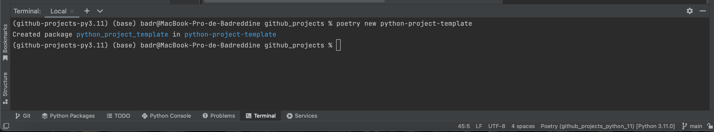

## Create the poetry interpreter
* Step 1: Add new local interpreter
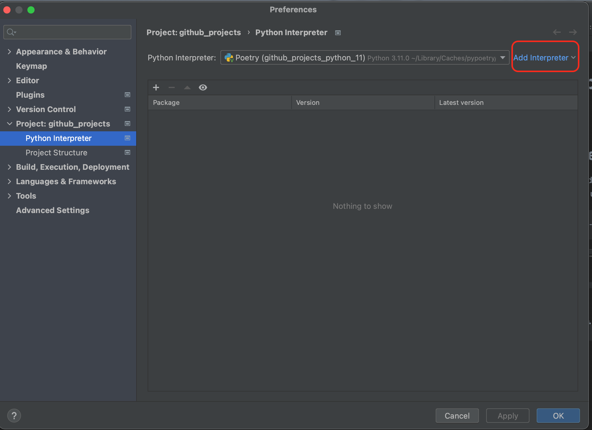
* Step 2: Create a new poetry interpreter
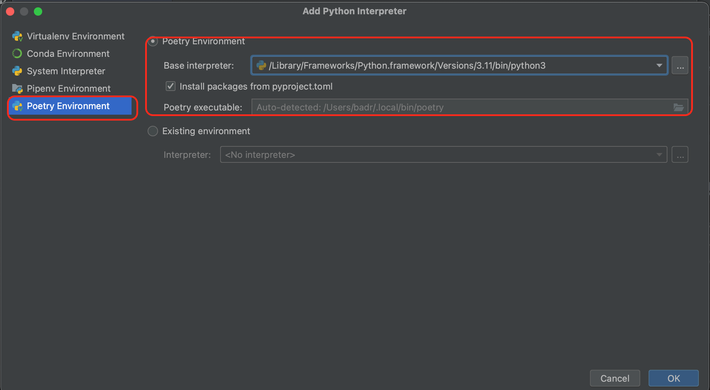
  * Step 3: Rename the newly created poetry interpreter
  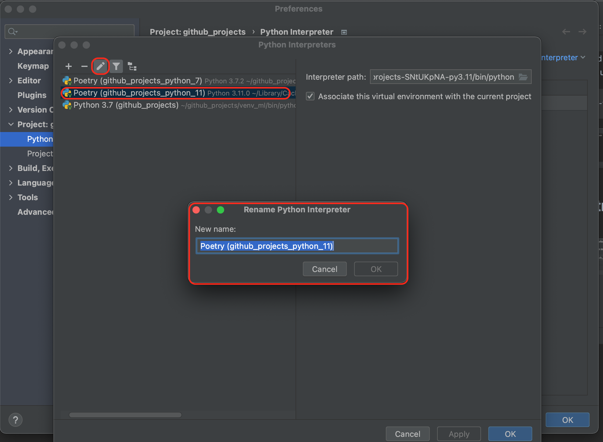
  
        venv location: /Users/badr/Library/Caches/pypoetry/virtualenvs/github-projects-SNtUKpNA-py3.11/bin
  
## Install the requirements using poetry:
* poetry add sklearn
* poetry add pandas
* ...

## Automatic format of the python code

* Install ```black``` package:

```bash
poetry add black --group dev
```
* How to use?

  Either to open a terminal and write:
```bash
black python_script_name.py
```
or if we want to format more than one python file, write :
```bash
black folder_name/
```
or using pre-commit automatic formatting:
* First, we need to install not only black but also pre-commit package:
```bash
poetry add pre-commit
```
* Create a new file and name it: ```.pre-commit-config.yaml```
* Write in the file the following code, make sure you are choosing your 
current python version ```python --version```:
```
repos:
-   repo: https://github.com/psf/black
    rev: stable
    hooks:
    - id: black
      language_version: python3.11.0
```
* Install pre-commit, meaning, create a new hook for the yaml file. 
Using the terminal, change the current working directory to your local project 
(where the yaml file is created and then execute:
```
pre-commit install
```
* Install mypy
```
poetry add mypy --group dev
```
pylint setting in external tools

Resources
* https://www.jetbrains.com/help/pycharm/configuring-third-party-tools.html#web-browsers


config:


argument: "--msg-template='{abspath}:{line:5d},{column:2d}: {msg} ({symbol})'" --output-format=colorized "$FilePath$"

workingdir: $ProjectFileDir$

output: filters: $FILE_PATH$:\s*$LINE$\,\s*$COLUMN$:


## Add the local python project to your GitHub
* Open the terminal, change the current working directory to your local project.
* Initialize the local directory as a Git repository.
```
git init
```
* Stage and commit all the files in your project:
```
git add . && git commit -m "initial commit"
```
* To create a repository for your project on GitHub, use the ```gh repo create ``` subcommand.

If it is the first time you are adding a project to your GitHub you need to set up few things:
- First, install ```gh```:
```
poetry add gh --group dev
```
```
brew install gh
```
- Now, when you type ```gh repo create ``` on the terminal, it will ask you to login:

-Go to the GitHub website and generate new classic token:
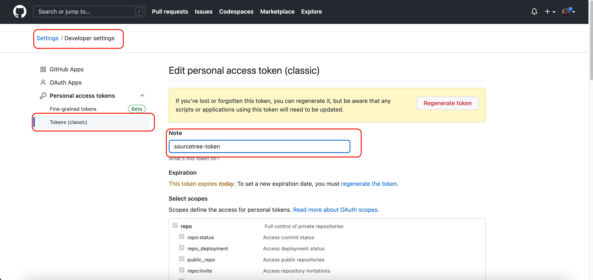
- Configure SourceTree:
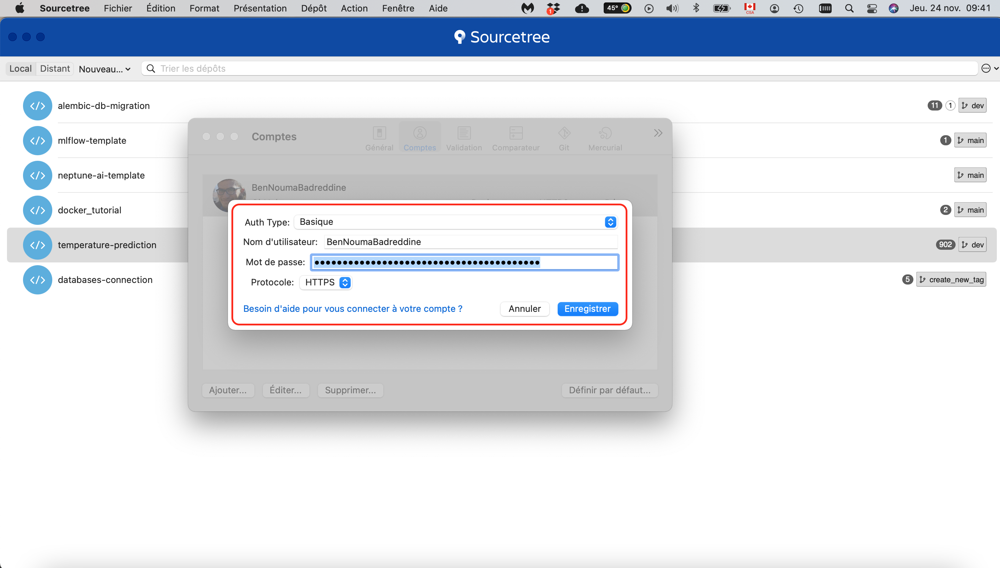
- Configure Pycharm:
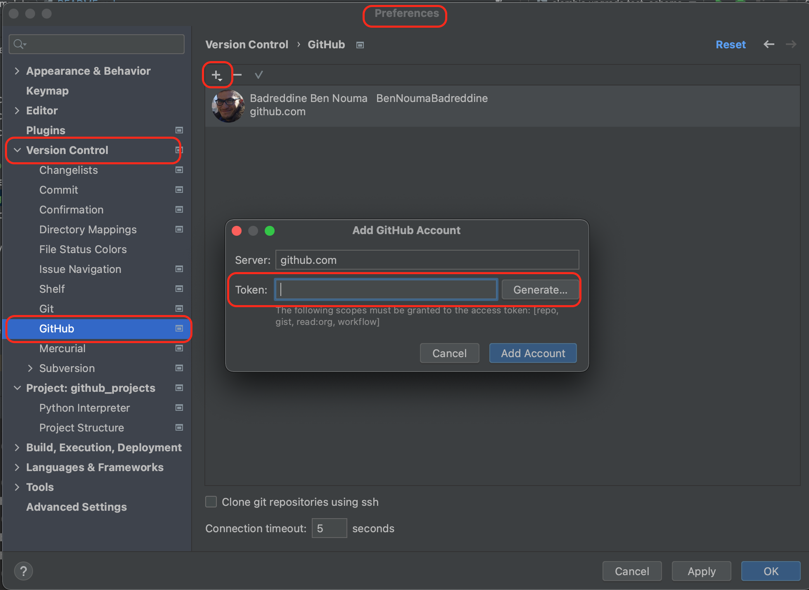
- GitHub's authentication: 
- Solution 1: 
- Create a file ```script.sh``` containing the following:
```
#!/bin/env bash
set -u
echo "$GITHUB_TOKEN" > .githubtoken
unset GITHUB_TOKEN
gh auth login --with-token < .githubtoken
rm .githubtoken
gh release create $VERSION --notes "Release $VERSION. $COMMIT_MESSAGE"
```
- Create a configuration file with adding some environmental variables:
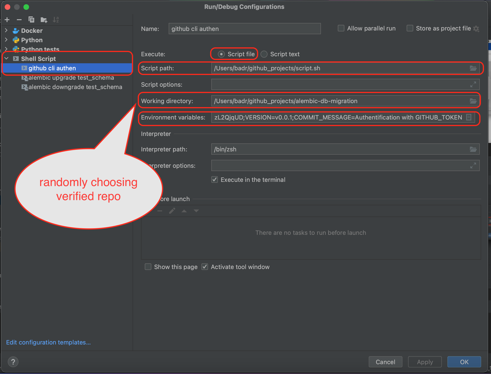
- Execute the shell script to validate the authentication.
After executing that script you will be able to create a repo using 
```bash
gh repo create
```
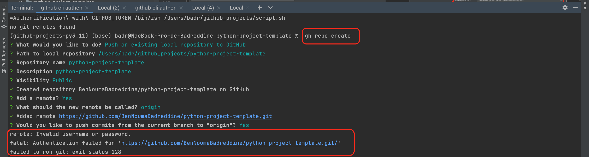
To set the password and commit/push changes:
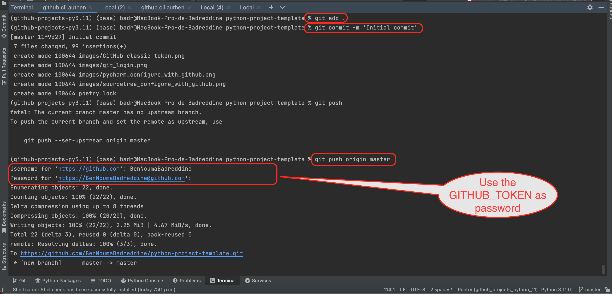

## First use of ```black``` formatting tool 
* After installing the pre-commit ```pre-commit install```
inside the GitHub repository, a hidden folder called ```.git``` will be created.
Then, after you finish with your python script code, you need to check the code format (extra empty line or space, etc.), all you need 
is to add your files ```git add .``` then commit ```git commit -m 'your comment' ```.
If your added files are already formatted, the commit will pass.
* If the commit fails, what happen next is that before committing your code, the pre-commit 
hook will check your code format and will automatically update your code.
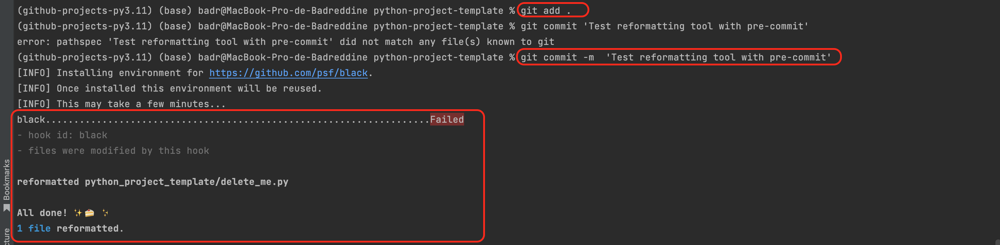
* What you have to do is to repeat add, commit and push your code into the remote repo.
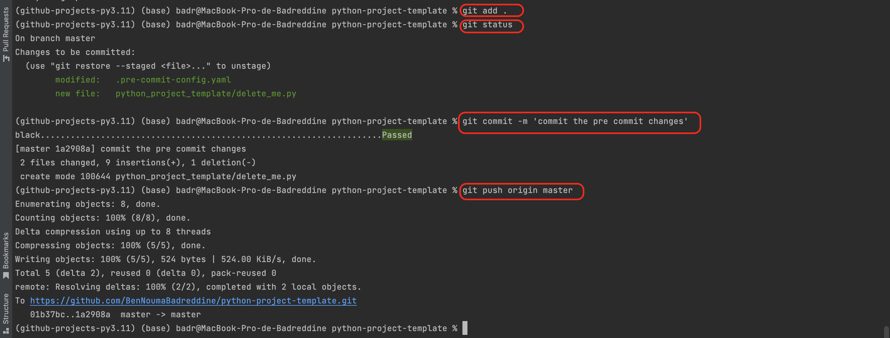


