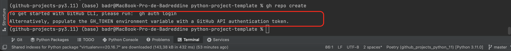
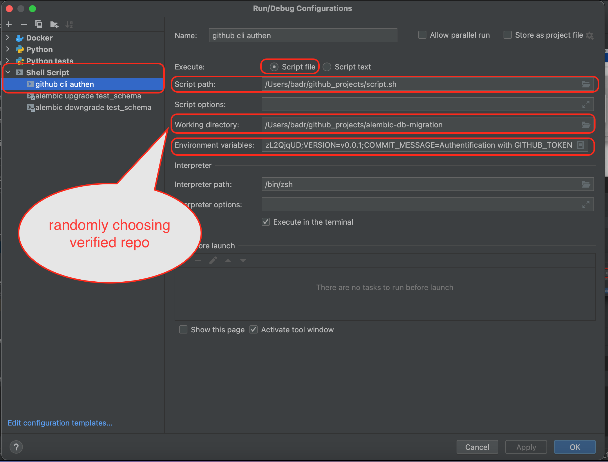
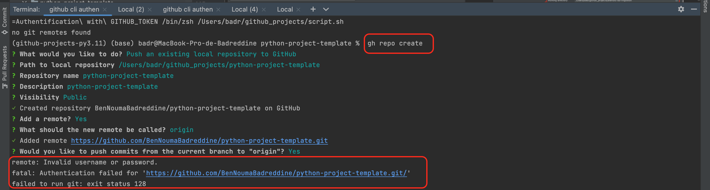
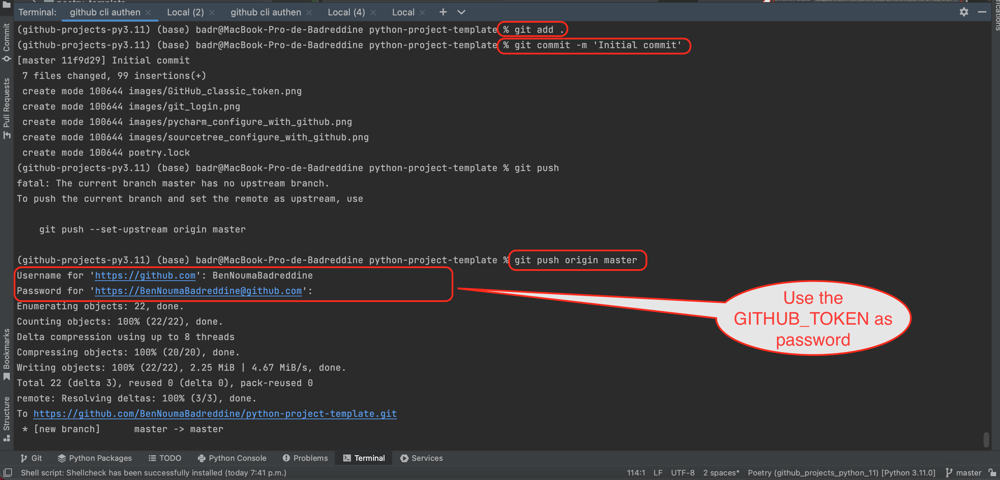

# Add a local python project to your GitHub
## Simplest solution
* Open the GitHub website and create an empty repo having the name of your project.
* Using sourceTree clone the remote repository into your local directory.
* Copy and paste all your file from your local project to the cloned remote repo.
* Add all files, then commit and push
* Done

## Solution with no website
* Open the terminal, change the current working directory to your local project.
* Initialize the local directory as a Git repository.
```
git init
```
* Stage and commit all the files in your project:
```
git add . && git commit -m "initial commit"
```
* To create a repository for your project on GitHub, use the ```gh repo create ``` subcommand.

If it is the first time you are adding a project to your GitHub you need to set up few things:
- First, install ```gh```:
```
poetry add gh --group dev
```
```
brew install gh
```
- Now, when you type ```gh repo create ``` on the terminal, it will ask you to login:


- GitHub's authentication: 
- Solution 1: 
- Create a file ```script.sh``` containing the following:
```
#!/bin/env bash
set -u
echo "$GITHUB_TOKEN" > .githubtoken
unset GITHUB_TOKEN
gh auth login --with-token < .githubtoken
rm .githubtoken
gh release create $VERSION --notes "Release $VERSION. $COMMIT_MESSAGE"
```
- Create a configuration file with adding some environmental variables:

- Execute the shell script to validate the authentication.
After executing that script you will be able to create a repo using 
```bash
gh repo create
```

To set the password and commit/push changes:

