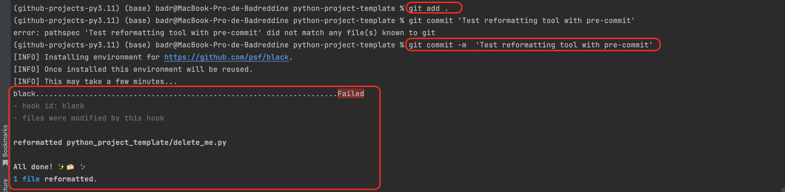
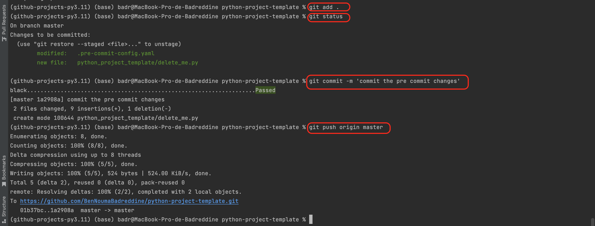

# Black: Automatic format of the python code

* Install ```black``` package:

```bash
poetry add black --group dev
```
* How to use?

  Either to open a terminal and write:
```bash
black python_script_name.py
```
or if we want to format more than one python file, write :
```bash
black folder_name/
```
or using pre-commit automatic formatting before committing your code (please see: [pre_commit_demo.md](pre_commit_demo.md)) .


## First use of ```black``` formatting tool 
* After installing the pre-commit ```pre-commit install```
inside the GitHub repository, a hidden folder called ```.git``` will be created.
Then, after you finish with your python script code, you need to check the code format (extra empty line or space, etc.), all you need 
is to add your files ```git add .``` then commit ```git commit -m 'your comment' ```.
If your added files are already formatted, the commit will pass.
* If the commit fails, what happen next is that before committing your code, the pre-commit 
hook will check your code format and will automatically update your code.

* What you have to do is to repeat add, commit and push your code into the remote repo.

