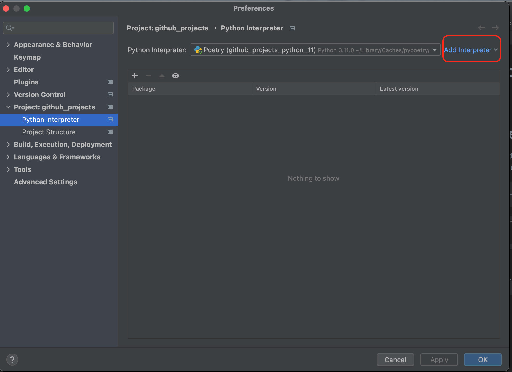
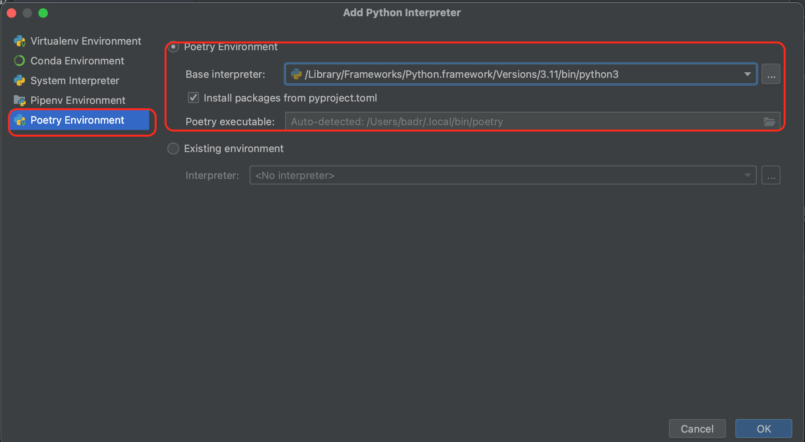
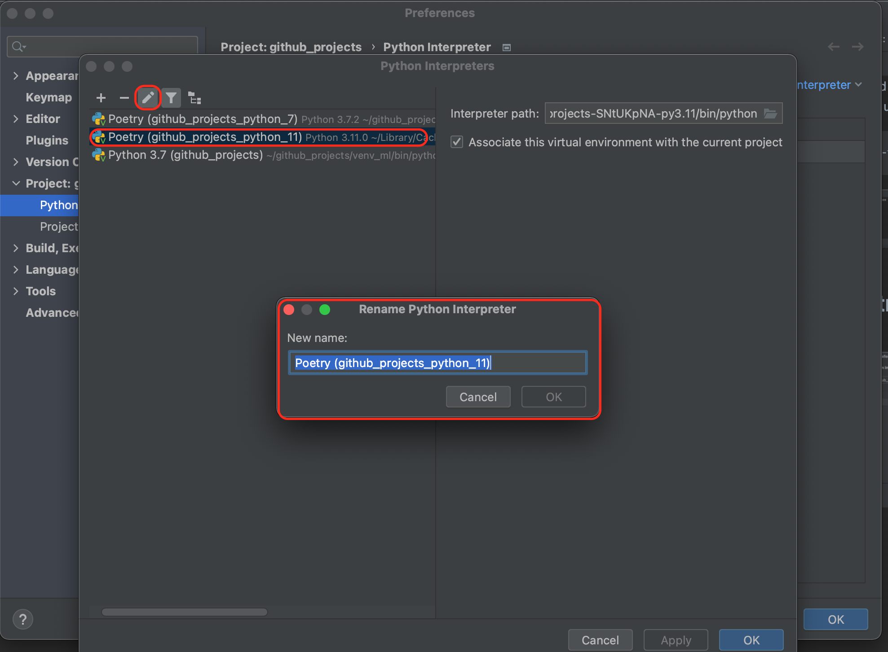

# Create the poetry interpreter
## Step 1: Add new local interpreter

## Step 2: Create a new poetry interpreter

## Step 3: Rename the newly created poetry interpreter
  
  
        venv location: /Users/badr/Library/Caches/pypoetry/virtualenvs/github-projects-SNtUKpNA-py3.11/bin
  
## Install the requirements using poetry:
* poetry add sklearn
* poetry add pandas
* ...